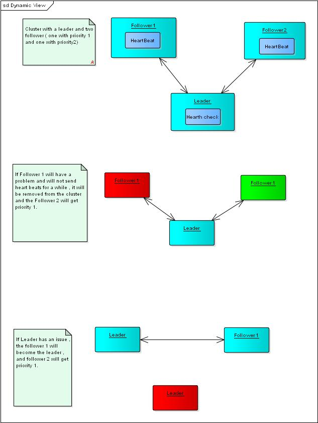

# Ring election  
[](https://travis-ci.org/pioardi/ring-election) <br>
[](https://coveralls.io/github/pioardi/ring-election)

<h2>Contents</h2>
<a href="#overview">Overview</a><br>
<a href="#config">Config</a><br>
<a href="#todo">Vision</a><br>
<a href="#hld">High level design</a><br>
<a href="#examples">Examples </><br>


<h2 id="overview">Overview and rationale</h2>
In modern systems, data partitioning is often guaranteed by a distributed database (for example, cassandra),but often it is also needed to distribute the application load to make the system scalable so that every data is processed by a single instance. <br>
Ring-election is a driver that implements a distributed algorithm in order to make easy data partitioning and resolve problems as concurrency,distributed computing,distributed caching.<br>
The algorithm will assign to each node one or more partitions to work with.<br>
A node will be removed if it does not send an hearth beat for a while , this process is called heart check.<br>
Each node in the ring will have an ID and a priority , if the leader node will die the node with lower priority will be elect as leader.


<h2 id="config"> Configuration </h2>
 PORT : The leader will start to listen on this port , default is 3000 <br>
 TIME_TO_RECONNECT: The time to wait for a follower when he has to connect to a new leader in ms , default is 3000 <br>
 HEARTH_BEAT_FREQUENCY: The frequency with which a hearth beat is performed by a follower , default is 1000 <br>
 HEARTH_BEAT_CHECK_FREQUENCY: The frequency with which an hearth check is performed by a leader , default is 3000 <br>
 LOG_LEVEL: Follow this https://www.npmjs.com/package/winston#logging-levels , default is info.<br>
 NUM_PARTITIONS: Number of partitions to distribute across the cluster , default is 10. <br>
 SEED_NODE : hostname of leader node , default is localhost

<h2 id="todo">TODO List </h2>
Integration tests and examples <br>
Continous integration <br>
Allow to specify more contact points when a node join the cluster <br>
Re-add a client in the cluster when it was removed and send an hearth beat <br>
Monitoring ring status with REST API<br>
Retry leader reconnection <br>

<h2 id="hld">High Level Diagram</h2>



<h2>Examples</h2>
<strong>How to leader</strong><br>

```javascript
const ring = require('ring-election');
ring.leader.createServer();
// to get ring info
ring.leader.ring();
```
<strong>How to follower</strong><br>

```javascript
const ring = require('ring-election');
ring.follower.createClient();
// to get ring info
ring.follower.ring();
// to get assigned partitions
ring.follower.partitions();
```

See examples folder for more advanced examples

