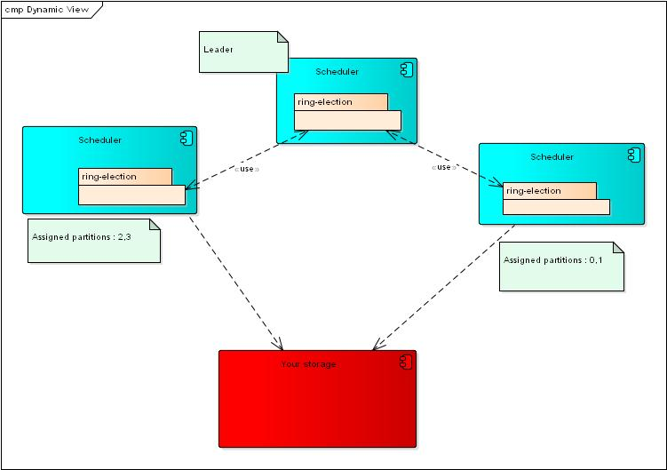

# Ring election

<div align="center">
   
</div>

[](https://coveralls.io/github/pioardi/ring-election?branch=master)
[](https://travis-ci.org/pioardi/ring-election)
[](https://github.com/pioardi/ring-election/actions)
[](https://www.codacy.com/app/alessandroardizio94/ring-election?utm_source=github.com&amp;utm_medium=referral&amp;utm_content=pioardi/ring-election&amp;utm_campaign=Badge_Grade)
<a href="https://badge.fury.io/js/ring-election"></a>
[](https://gitter.im/ring-election)<br>
[](https://github.com/standard/standard)


<h2>Contents </h2>
<a href="#gs">Getting started</a><br>
<a href="#overview">Overview</a><br>
<a href="#usecases">Use cases</a><br>
<a href="#howto">How to integrate</><br>
<a href="#config">Config</a><br>
<a href="#monitoring">Monitoring</a><br>
<a href="#todo">Vision</a><br>
<a href="#hld">High level design</a><br>
<a href="#contribute">Contribute</a><br>
<a href="#versioning">Versioning</a><br>
<a href="#license">License</a><br>


<h2 id="gs">Getting started</h2>
<strong> Try it out ! </strong>

```bash
   docker-compose up 
```
Check assigned partitions to local:9000/status or change the port to 9001/9002 <br>
Try to stop and restart container and observe the behaviour.<br>
If you want to develop new features or fix a bug you can do that without docker images , just configure environment variables correctly ( you can see them on [docker-compose.yaml] file) . <br>
See <a href="#examples">Examples</a> section to know how to integrate this library and build some distributed ring on top of ring-election !!! <br>

<h2 id="overview">Overview and rationale</h2>
In modern systems it is often needed to distribute the application load to make the system scalable so that every data is processed by a single instance. <br>
Ring-election is a driver that implements a distributed algorithm that assigns to each node the partitions to work on .
In a simple use case each node can obtain data that are part of the partitions of which it is owner and work on them. <br>
The algorithm will assign to each node one or more partitions to work with.<br>
A node will be removed if it does not send an hearth beat for a while , this process is called heart check.<br>
Each node in the ring will have an ID and a priority , if the leader node will die the node with lower priority will be elect as leader. <br>
If a node is added or removed from the cluster, the allocated partitions will be rebalanced.

<strong>What the ring-election driver offers you ?</strong><br>

- A default partitioner that for an object returns the partition to which it is assigned.<br>
- Mechanism of leader election<br>
- Failure detection between nodes.<br>
- Assignment and rebalancing of partitions between nodes<br>
- Automatic re-election of the leader<br>

<strong>What problems can you solve with this driver ?</strong><br>
- Scalability<br>
- High availability<br>
- Concurrency between nodes in a cluster<br>
- Automatic failover<br>
   
<h2 id="usecases">Use cases</h2>

This section introduce you on what you can build on top of ring-election using it as driver/library. <br>

<strong>Distributed Scheduler</strong><br>
Each Scheduler instance will work on the assigned partitions .<br>
A real implementation of this use case is available here https://github.com/pioardi/hurricane-scheduler <br>



<strong>Distributed lock</strong><br>
<strong>Distributed cache</strong><br>
<strong>Distributed computing</strong><br>   

<h2 id="howto">How to integrate as driver/library</h2>
<strong>How to leader</strong><br>

```javascript
const ring = require('ring-election');
let leader = ring.leader;
leader.createServer();
// if you want REST API as monitoring , invoke startMonitoring
leader.startMonitoring();
// to get ring info
ring.leader.ring();
// Your leader will be the coordinator.
```
<strong>How to follower</strong><br>

```javascript
const ring = require('ring-election')
let follower = ring.follower
const {
  BECOME_LEADER,
  PARTITIONS_ASSIGNED,
  PARTITIONS_REVOKED
} = ring.constants;
follower.createClient()
// if you want REST API as monitoring , invoke startMonitoring
follower.startMonitoring()
// to get ring info
ring.follower.ring()
// to get assigned partitions
let assignedPartitions = ring.follower.partitions()
// now let me assume that a follower will create some data
// and you want to partition this data
let partition = ring.follower.defaultPartitioner('KEY')
// save your data including the partition on a storage
// you will be the only one in the cluster working on the partitions assigned to you.

// If you want to handle partitions assigned ( use other constants to listen other events ) you can do in this way.
ring.follower.eventListener.on(PARTITIONS_ASSIGNED , (newAssignedPartitions) => {
   // DO STUFF
})
```

<strong> Try it out ! </strong>
```bash
   docker image build -t ring-election .
   docker-compose up
```

 
See examples folder for more advanced examples


<h2 id="config"> Configuration </h2>
 <strong>PORT</strong> : The leader will start to listen on this port , default is 3000 <br>
  <strong>TIME_TO_RECONNECT</strong>: The time to wait for a follower when he has to connect to a new leader in ms , default is 3000 <br>
  <strong>HEARTH_BEAT_FREQUENCY</strong>: The frequency with which a hearth beat is performed by a follower , default is 1000 <br>
  <strong>HEARTH_BEAT_CHECK_FREQUENCY</strong>: The frequency with which an hearth check is performed by a leader , default is 3000 <br>
  <strong>LOG_LEVEL</strong>: Follow this https://www.npmjs.com/package/winston#logging-levels , default is info.<br>
  <strong>NUM_PARTITIONS</strong>: Number of partitions to distribute across the cluster , default is 10. <br>
  <strong>SEED_NODES</strong> : hostnames and ports of leader node comma separated, Ex . hostname1:port,hostname2:port <br>
  <strong>MONITORING_PORT</strong> : port to expose rest service for monitoring , default is 9000<br>

<h2 id="monitoring"> Monitoring API </h2>
To monitor your cluster contact any node on the path /status (HTTP verb :  GET) or contact a follower node on /partitions (HTTP verb :  GET). <br>


<h2 id="todo">TODO List </h2>

Re-add a client in the cluster when it was removed and send an hearth beat<br>
Implement event emitter to notify library users when something happens
<h2 id="hld">High Level Diagram</h2>


<h2 id="contribute">How to contribute</h2>
This repo use standard js style , please use it if you want to contribute <br>
Take tasks from todo list, develop a new feature or fix a bug and do a pull request.<br>
<strong>How to run tests</strong><br>
<strong>Unit tests </strong> <br>
npm run test <br><br>
<strong>Integration tests</strong><br>
cd  test/integration <br>
./integration.sh <br>
npm run integration-test<br> <br>
<strong> How to check if your new code is standard style </strong><br>
npm run standard <br> 
If you want to lint your code run --> npm run lint


<h2 id="versioning">Versioning</h2>
We use (http://semver.org/) for versioning.

<h2 id="license">License</h2>
This project is licensed under the MIT License - see the [LICENSE.md] file for details
